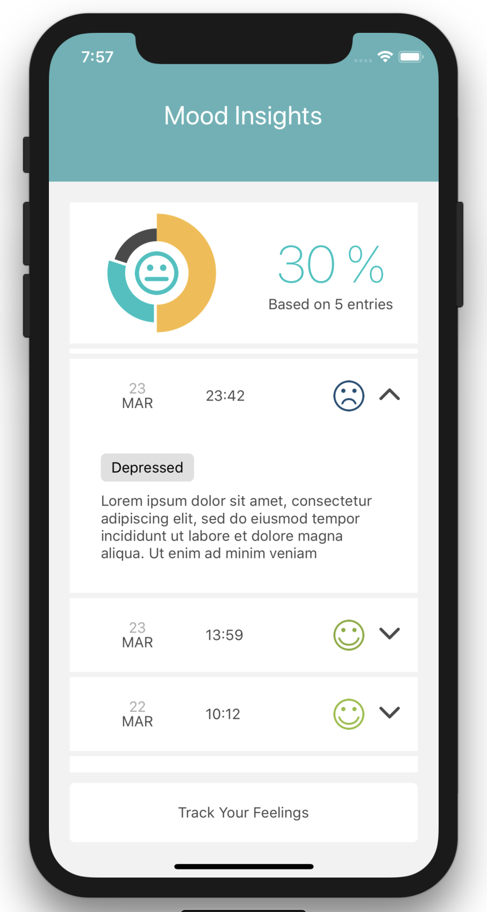
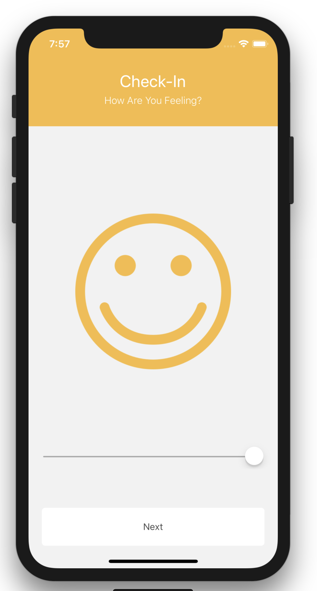
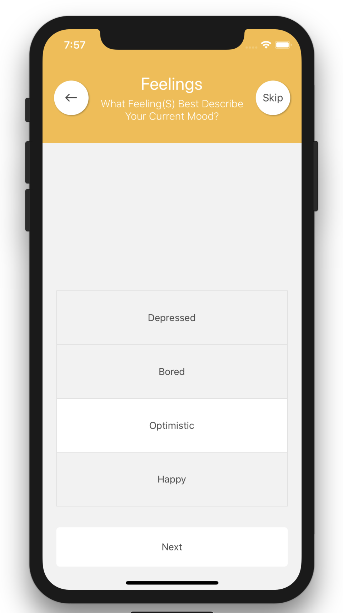
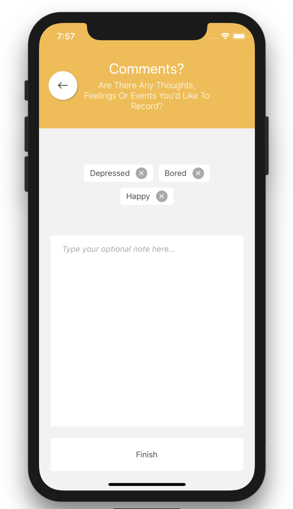

# moodTracker
A React Native application built with the following technologies:

### State managment
* redux
* redux-ignore
* redux-persist

### Side effect and async operations
* redux-logic

### Routing
* react-navigation

### Network (only mocked)
* axios
* axios-mock-adapter

### TODO

* implement reselect for selectors
* complete redux testing
* add UI tests

## Instructions

* navigate to `moodTrackerApp`
* to start the project run `npm run ios`
* to start test run `npm test:withgui`

## Screenshots

